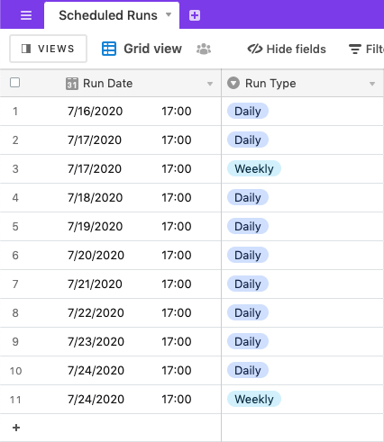
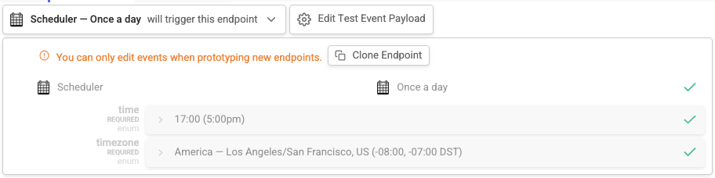
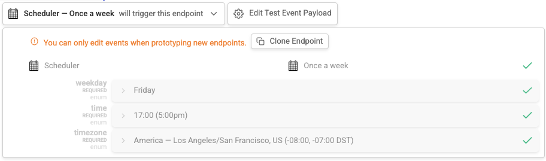

# Airtable Add Record On Schedule

## Project Overview

This project contains an example of how to add a new record to an Airtable Base scheduled on a daily and weekly basis. It uses the [airtable.records.create](https://autocode.com/stdlib/airtable/records/#create) API from Autocode's Standard Library. You can deploy your own working version of this project in just a few clicks with Autocode.

Click the button above to open this project in Autocode, and create a copy of the sample base on your own Airtable account by clicking this link: https://airtable.com/addBaseFromShare/shr6tBr5SEU3ha5km. Then, link your copy of the base to your project in Autocode and deploy!

Like all Autocode templates, the endpoints and what data you'd like to store as Airtable records are completely customizable in this project –– everything is code that you can edit and test using the Autocode editor.

## Endpoints

These endpoints will be triggered at the appropriate times when the scheduler is configured to run.

### functions/events/scheduler/daily.js

This endpoint is triggered once a day, you can configure the time of day and the timezone in which it runs. It creates a new Record in the linked Airtable Base that contains the date/time when it ran, as well as the run type `Daily`. This daily scheduler is configured to run every day at 5pm Pacific (LA/SF) Time.

### functions/events/scheduler/weekly.js

This endpoint is trigged once a week, you can configure the day of the week, time of day and the timezone in which it runs. It creates a new Record in the linked Airtable Base that contains the date/time when it ran, as well as the run type `Weekly`. This weekly scheduler is configured to run every Friday at 5pm Pacific (LA/SF) Time.

## Thank You!

Please check out [Autocode](https://autocode.com) or follow us on Twitter, [@AutocodeHQ](https://twitter.com/AutocodeHQ).
